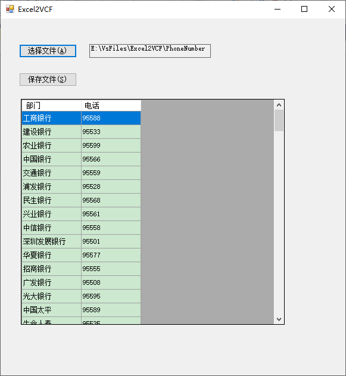

# Excel2VCF

#### Excel通讯录文件转换为安卓手机通讯录导入文件
将Excel文件内联系人,联系电话转换为安卓使用的通讯录文件,便于导入手机

目前问题:

1. 有多余空sheet时,会多余`F1`空数据列
1. 每个sheet表的title必须相同

如下:

|姓名|电话|
--|--|
|匪警|110|
|火警|119|

#### 使用说明

1. 选择Excel文件
2. 选择输入路径

